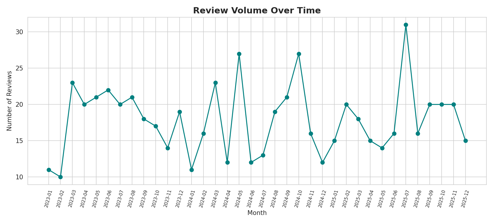
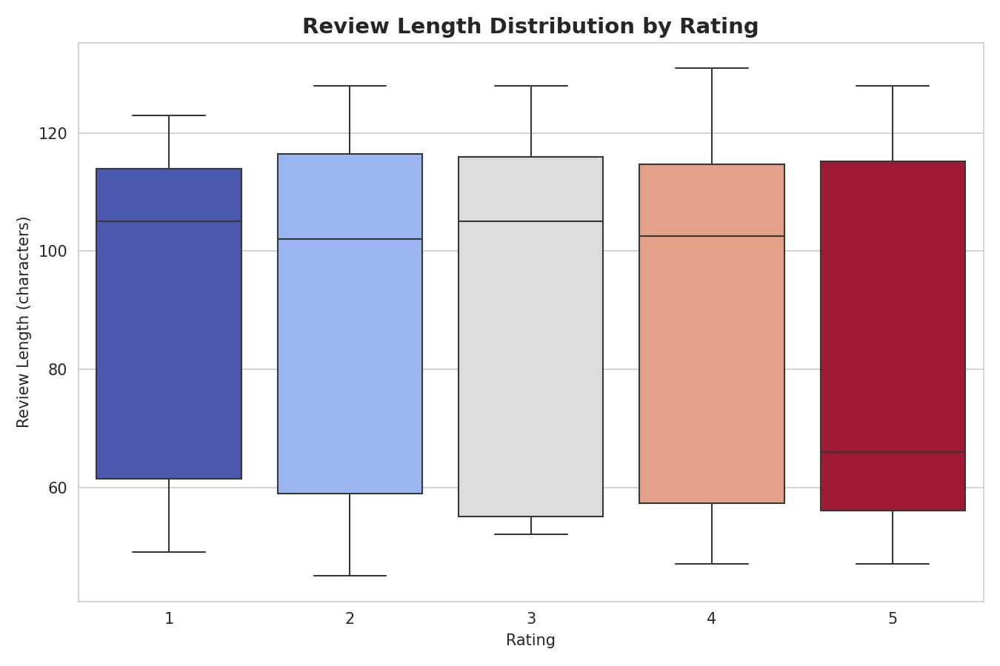

# CodeAlpha_DataVisualization

**CodeAlpha Data Analytics Internship — Task 3: Data Visualization**

## 📌 Overview
This project transforms a cleaned dataset of 650+ restaurant reviews into a suite of
clear, decision-supporting visualizations — bar charts, trend lines, heatmaps, box
plots, and a word cloud — built to reveal insights at a glance and support a
data-driven narrative.

## 🎯 What This Notebook Does
- Cleans the raw dataset (same pipeline as Task 2)
- Builds **6 distinct visualizations**, each answering a specific business question
- Exports every chart as a high-resolution PNG for reuse in reports/presentations

## 🖼 Visual Gallery — Best Visualizations

### 1. Rating Distribution

*Most reviews cluster around 3-4 stars, with a long tail of 1-star experiences.*

### 2. Average Rating by Cuisine

*Japanese and Thai cuisines lead in average satisfaction; French trails behind.*

### 3. Review Volume Over Time

*Monthly review trend across the 2023-2025 window, useful for spotting seasonality.*

### 4. Cuisine vs City Heatmap

*Cross-referencing cuisine type and city surfaces geographic performance gaps.*

### 5. Review Length by Rating

*Customers write longer reviews at the extremes — very happy or very unhappy.*

### 6. Word Cloud of Review Text

*The most frequent words across all reviews, blending praise and complaints.*

## 🗂 Structure
```
CodeAlpha_DataVisualization/
├── data/
│   ├── generate_dataset.py
│   └── restaurant_reviews.csv
├── notebook/
│   └── Task3_Data_Visualization.ipynb
├── charts/
│   ├── 01_rating_distribution.png
│   ├── 02_avg_rating_by_cuisine.png
│   ├── 03_review_volume_over_time.png
│   ├── 04_cuisine_city_heatmap.png
│   ├── 05_review_length_by_rating.png
│   └── 06_wordcloud.png
└── README.md
```

## 🛠 Tools
Python · pandas · matplotlib · seaborn · wordcloud

## ▶️ Run It
```bash
pip install pandas numpy matplotlib seaborn wordcloud jupyter
jupyter notebook notebook/Task3_Data_Visualization.ipynb
```

## 🎓 Internship
Completed as part of the **CodeAlpha Data Analytics Internship** — Task 3 of 4.

- 🔗 LinkedIn post: *(add your post link here)*
- 🎥 Video walkthrough: *(add your video link here)*

---
*#codealpha #dataanalytics #datavisualization #internship*
