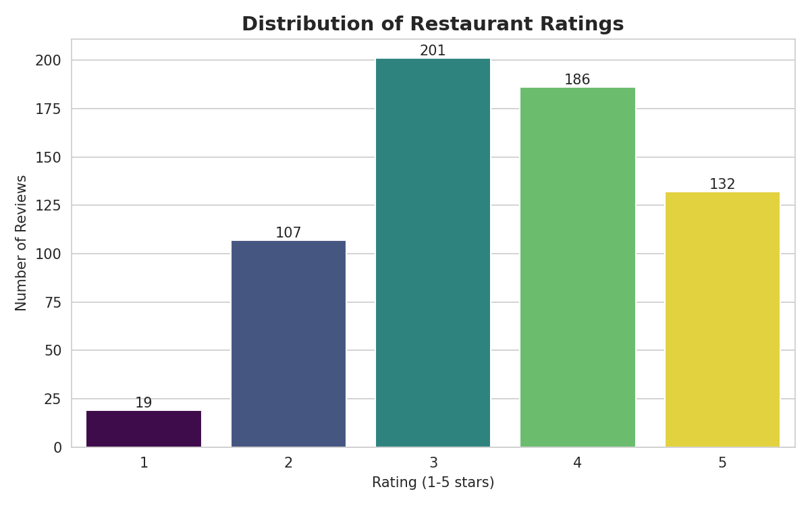

# CodeAlpha_ExploratoryDataAnalysis

**CodeAlpha Data Analytics Internship — Task 2: Exploratory Data Analysis (EDA)**

## 📌 Overview
This project performs exploratory data analysis on a dataset of 650+ restaurant
reviews (Yelp-style), spanning 20 restaurants across 8 cuisines and 8 cities. The goal
of EDA is to understand the data before drawing conclusions from it: check structure,
spot data-quality problems, and surface patterns worth investigating further.

## 🎯 What This Notebook Does
- Loads and inspects the raw dataset (shape, dtypes, summary statistics)
- Detects and documents **data-quality issues**: missing values, duplicate rows, and a
  mixed-type `rating` column
- Cleans the dataset into an analysis-ready form
- Answers key exploratory questions:
  - What does the overall rating distribution look like?
  - Which restaurants and cuisines perform best/worst?
  - Are there patterns in review volume over time?
  - Does review length relate to rating?

## 🖼 Best Visual


*Distribution of star ratings across all 645 cleaned reviews — the foundation for every
downstream question in this project.*

## 🔑 Key Findings
| Metric | Value |
|---|---|
| Raw reviews | 658 |
| Reviews after cleaning | 645 |
| Duplicate rows removed | 8 |
| Missing `city` values (filled) | 15 |
| Average rating | 3.47 / 5 |
| Top cuisine (avg rating) | Japanese (4.30) |
| Lowest-rated restaurant | Le Petit Bistro (2.61) |

## 🗂 Structure
```
CodeAlpha_ExploratoryDataAnalysis/
├── data/
│   ├── generate_dataset.py
│   └── restaurant_reviews.csv
├── notebook/
│   └── Task2_EDA_Analysis.ipynb
├── charts/
│   └── 01_rating_distribution.png
└── README.md
```

## 🛠 Tools
Python · pandas · numpy · matplotlib · seaborn

## ▶️ Run It
```bash
pip install pandas numpy matplotlib seaborn jupyter
jupyter notebook notebook/Task2_EDA_Analysis.ipynb
```

## 🎓 Internship
Completed as part of the **CodeAlpha Data Analytics Internship** — Task 2 of 4.

- 🔗 LinkedIn post: *(add your post link here)*
- 🎥 Video walkthrough: *(add your video link here)*

---
*#codealpha #dataanalytics #eda #internship*
