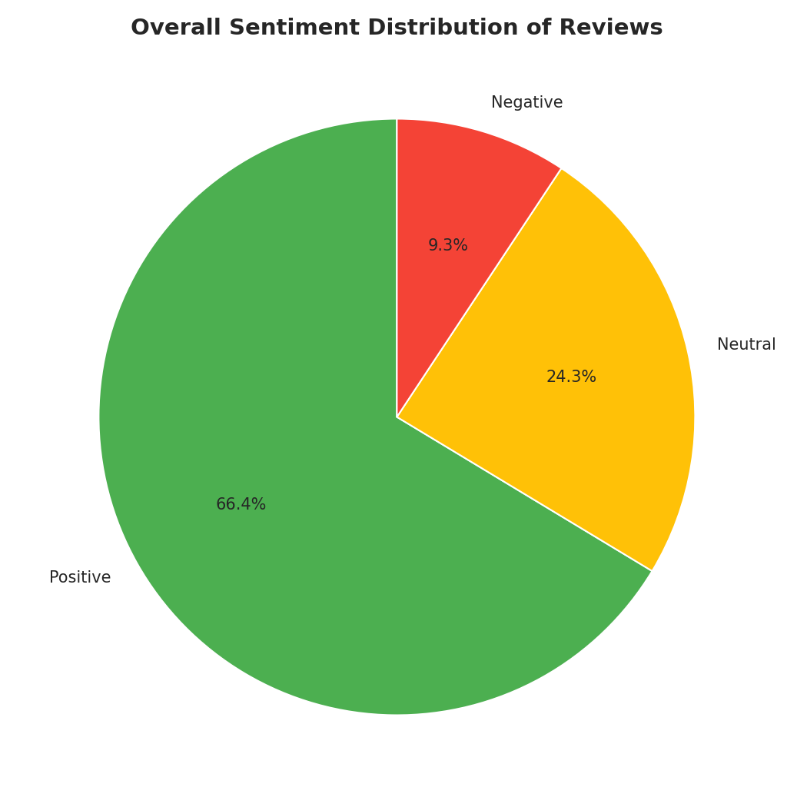
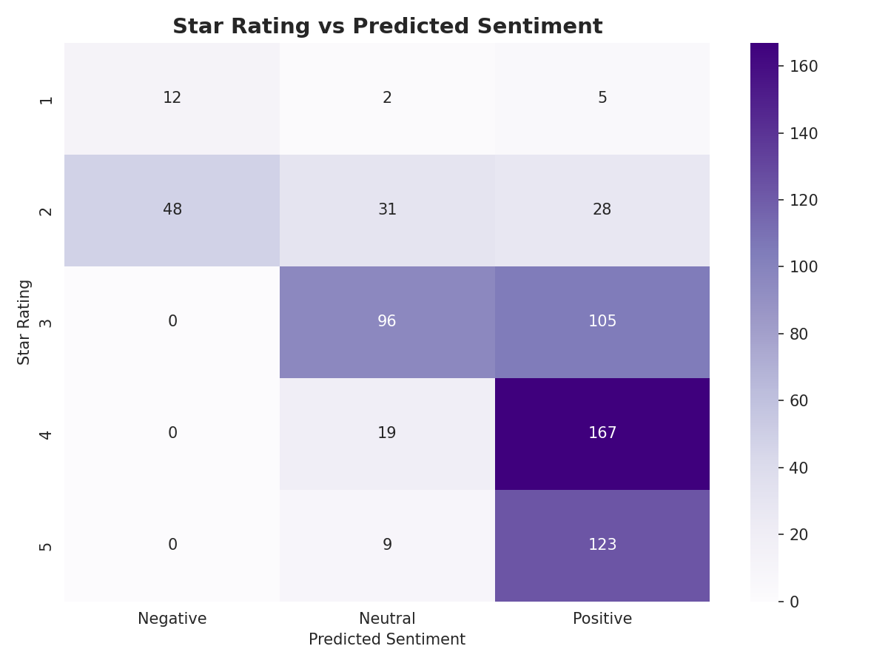
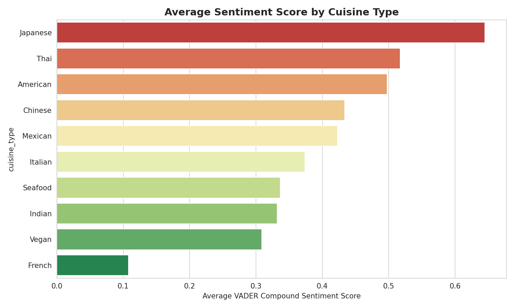

# CodeAlpha_SentimentAnalysis

**CodeAlpha Data Analytics Internship — Task 4: Sentiment Analysis**

## 📌 Overview
This project applies NLP-based sentiment analysis to a dataset of 650+ restaurant
reviews, classifying each review as Positive, Negative, or Neutral, and validating
those predictions against the star rating the customer actually gave.

## 🎯 What This Notebook Does
- Cleans the raw dataset (same pipeline as Task 2/3)
- Uses **VADER** (Valence Aware Dictionary and sEntiment Reasoner) — a lexicon-based
  sentiment tool well suited to short, informal text like reviews
- Classifies every review as Positive / Neutral / Negative
- Cross-validates sentiment predictions against star ratings to measure reliability
- Breaks down sentiment by cuisine type

## 🖼 Visual Gallery — Best Visualizations

### 1. Overall Sentiment Distribution

*66.4% of reviews are Positive, 24.3% Neutral, and 9.3% Negative.*

### 2. Star Rating vs Predicted Sentiment

*Cross-tabulation showing where text sentiment agrees — and disagrees — with the actual star rating.*

### 3. Sentiment Score by Cuisine

*Average VADER compound sentiment score per cuisine type, mirroring the rating patterns from Task 2/3.*

## 🔑 Key Findings
| Metric | Value |
|---|---|
| Positive reviews | 66.4% |
| Neutral reviews | 24.3% |
| Negative reviews | 9.3% |
| Agreement: sentiment vs star rating | **69.1%** |

**Why this matters:** text sentiment analysis is a reasonably reliable proxy for
customer satisfaction — useful for monitoring free-text feedback (social media,
support tickets) where no star rating exists.

## 🗂 Structure
```
CodeAlpha_SentimentAnalysis/
├── data/
│   ├── generate_dataset.py
│   └── restaurant_reviews.csv
├── notebook/
│   └── Task4_Sentiment_Analysis.ipynb
├── charts/
│   ├── 07_sentiment_distribution.png
│   ├── 08_rating_vs_sentiment.png
│   └── 09_sentiment_by_cuisine.png
└── README.md
```

## 🛠 Tools
Python · pandas · vaderSentiment · matplotlib · seaborn

## ▶️ Run It
```bash
pip install pandas numpy matplotlib seaborn vaderSentiment jupyter
jupyter notebook notebook/Task4_Sentiment_Analysis.ipynb
```

## 🎓 Internship
Completed as part of the **CodeAlpha Data Analytics Internship** — Task 4 of 4.

- 🔗 LinkedIn post: *(add your post link here)*
- 🎥 Video walkthrough: *(add your video link here)*

---
*#codealpha #dataanalytics #sentimentanalysis #nlp #internship*
