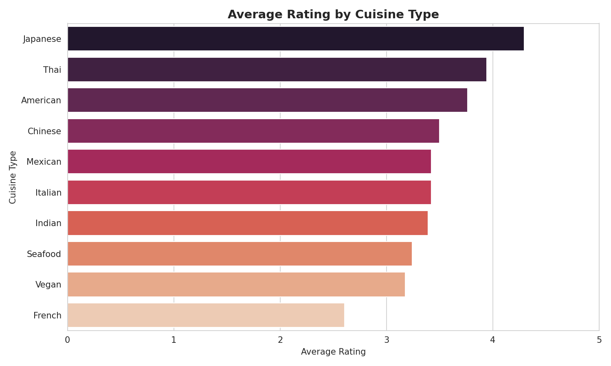
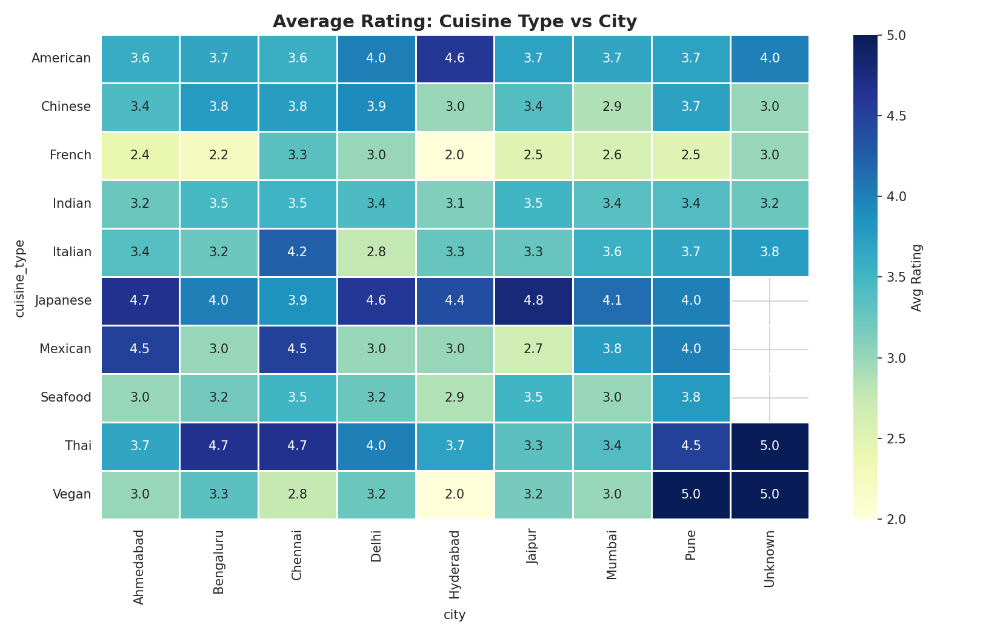
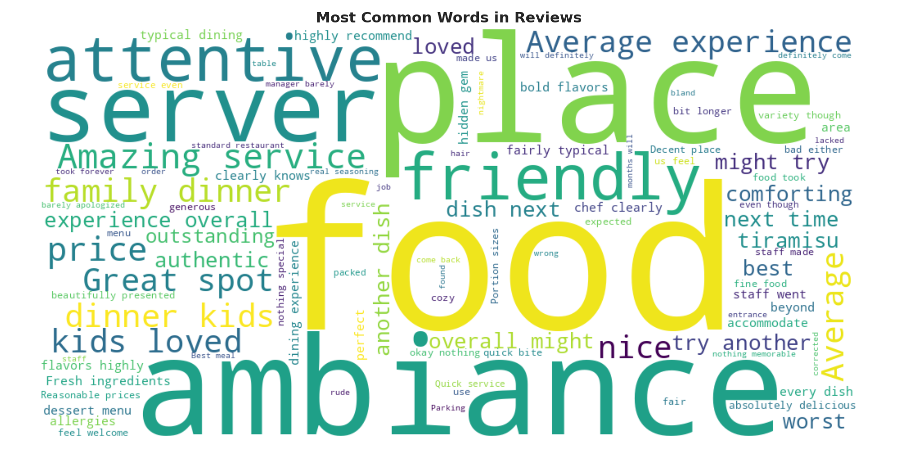

# CodeAlpha Data Analytics Internship — Restaurant Reviews Project

**Intern:** CodeAlpha Data Analytics Intern
**Tasks Completed:** Task 2 (EDA) · Task 3 (Data Visualization) · Task 4 (Sentiment Analysis)
**Dataset:** 650+ restaurant reviews (Yelp-style) across 20 restaurants, 8 cuisines, and 8 cities

## 📌 Project Overview

This project was completed as part of the **CodeAlpha Data Analytics Internship**. It
uses a single restaurant reviews dataset to complete three of the four internship
tasks — each submitted as its own standalone GitHub repository, and summarized
together here.

The story: clean a messy, realistic dataset → explore it → visualize the patterns →
classify review sentiment with NLP → validate sentiment against real star ratings.

## 🗂 Repositories

| Task | Repo Name | Description |
|---|---|---|
| Task 2 | [`CodeAlpha_ExploratoryDataAnalysis_Task2`](../CodeAlpha_ExploratoryDataAnalysis_Task2) | Data cleaning + exploratory analysis of ratings, cuisines, and trends |
| Task 3 | [`CodeAlpha_DataVisualization_Task3`](../CodeAlpha_DataVisualization_Task3) | 6-chart visualization suite: bar charts, heatmap, box plot, word cloud |
| Task 4 | [`CodeAlpha_SentimentAnalysis_Task4`](../CodeAlpha_SentimentAnalysis_Task4) | VADER-based sentiment classification, validated against star ratings |

*(Replace the links above with your actual GitHub repo URLs once pushed.)*

## 🖼 Best Visuals Across All Tasks

### Rating Distribution (Task 2 & 3)

### Average Rating by Cuisine (Task 3)

### Cuisine vs City Heatmap (Task 3)

### Word Cloud of Reviews (Task 3)

### Sentiment Distribution (Task 4)

### Star Rating vs Predicted Sentiment (Task 4)

## 🔑 Key Findings

| Metric | Value |
|---|---|
| Raw reviews collected | 658 |
| Reviews after cleaning | 645 |
| Duplicate rows removed | 8 |
| Missing values handled | 15 (`city`) |
| Average rating | 3.47 / 5 |
| Top cuisine by rating | Japanese (4.30) |
| Lowest-rated restaurant | Le Petit Bistro (2.61) |
| Positive sentiment | 66.4% |
| Neutral sentiment | 24.3% |
| Negative sentiment | 9.3% |
| Sentiment ↔ star rating agreement | 69.1% |

## 🛠 Tools & Libraries
Python · pandas · numpy · matplotlib · seaborn · wordcloud · vaderSentiment · Jupyter Notebook

## 📋 Task-by-Task Summary

**Task 2 — EDA:** Inspected structure, identified data-quality issues (mixed types,
duplicates, missing values), cleaned the dataset, and answered exploratory questions
about ratings, cuisines, and trends.

**Task 3 — Data Visualization:** Built 6 charts (rating distribution, cuisine
comparison, time trend, cuisine×city heatmap, review length box plot, word cloud) to
turn the cleaned data into a clear visual story.

**Task 4 — Sentiment Analysis:** Applied VADER sentiment analysis to review text,
classified reviews as Positive/Neutral/Negative, and validated predictions against
actual star ratings (69.1% agreement).

## 🎓 Internship Submission Checklist
- [ ] Push each task to its own GitHub repo (`CodeAlpha_ExploratoryDataAnalysis`, `CodeAlpha_DataVisualization`, `CodeAlpha_SentimentAnalysis`)
- [ ] Record video walkthrough(s) and post on LinkedIn tagging @CodeAlpha
- [ ] Include GitHub repo link(s) in the LinkedIn post
- [ ] Submit via the WhatsApp submission form

---
*#codealpha #dataanalytics #internship #eda #datavisualization #sentimentanalysis*
